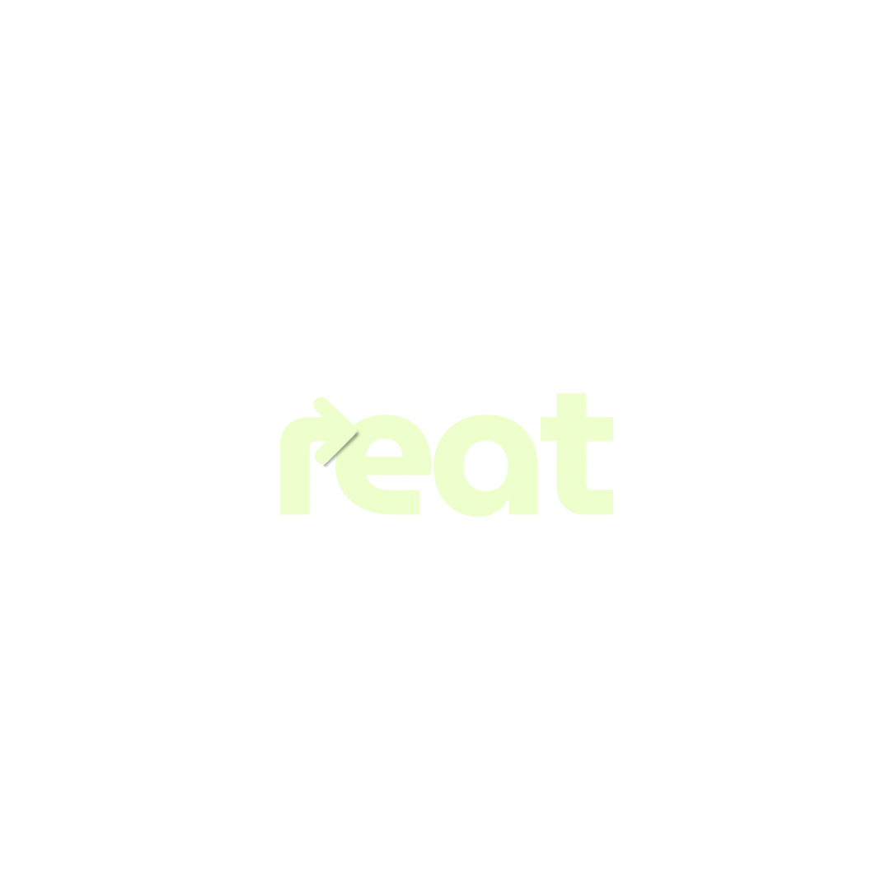

# FECAP - Fundação de Comércio Álvares Penteado

# Reat

## Projeto 3

## Integrantes: <a href="https://www.linkedin.com/in/rebeca-da-silva-vieira-850a83242">Rebeca da Silva Vieira</a>, <a href="https://www.linkedin.com/in/rafael-pinto-da-silva-8a6a982a5?trk=contact-info">Rafael Pinto da Silva</a>, <a href="https://www.linkedin.com/in/eduardo-fraga-santos">Eduardo fraga Alves dos Santos</a>, <a href="https://www.linkedin.com/in/gabriel-berto-167475141/">Gabriel Berto Horácio da Silva</a>, <a href="https://www.linkedin.com">Lucas Silva Cardiais</a>, <a href="https://www.linkedin.com/in/nicolas-bueno-zagatto-b274451a4/">Nicolas Bueno Zagatto</a>, <a href="https://www.linkedin.com">Nicolle Costa</a>, <a href="https://www.linkedin.com">Vinicius Burato</a>

## Professores Orientadores: <a href="https://www.linkedin.com/in/victorbarq/">Victor Bruno Alexander Rosetti de Quiroz</a>, <a href="https://www.linkedin.com/in/lucymari/">Lucy Mari Tabuti</a>, <a href="https://www.linkedin.com/in/eduardo-savino-gomes-77833a10/">Eduardo Savino Gomes</a>, <a href="https://www.linkedin.com/in/edsonbarbero/">Edson Barbero</a>, <a href="https://www.linkedin.com/in/aimarlopes/">Aimar Martins Lopes</a>

## Descrição

<b>Reat</b> é uma ferramenta inteligente que ajuda os usuários a minimizar o desperdício de alimentos em suas residências.
  
Nossa solução solicita ao usuário os alimentos disponíveis em sua residência e quantidade de pessoas que serão atendidas na refeição por meio de um chatbot interativo, a partir daí com o uso de inteligência artificial serão listadas sugestões de refeições criativas que atendem a suas necessidades e fazem bom uso de seus recursos, minimizando o descarte por excesso e depreciação de alimentos não utilizados. 
  

## 🛠 Estrutura de pastas

-Raiz 
| 
|-->documentos 
  &emsp;|-->Entrega 1 
  &emsp;|-->Entrega 2 
  &emsp;|-->Entrega 3 
  &emsp;|-->Entrega 4 
|-->imagens 
|-->src 
  &emsp;|-->Entrega 1 
   &emsp;&emsp;|-->Backend 
   &emsp;&emsp;|-->Frontend 
  &emsp;|-->Entrega 2 
   &emsp;&emsp;|-->Backend 
   &emsp;&emsp;|-->Frontend 
  &emsp;|-->Entrega 3 
   &emsp;&emsp;|-->Backend 
   &emsp;&emsp;|-->Frontend 
  &emsp;|-->Entrega 4 (PROJETO FINAL) 
   &emsp;&emsp;|-->Backend 
  &emsp;&emsp;|-->Frontend 
|readme.md 

Há 3 pastas que seguem da seguinte forma:

<b>documentos</b>: Toda a documentação estará nesta pasta, tal como as entregas não referentes aos código. Salvo exceções como algoritmos de análise.

<b>imagens</b>: Imagens como logo.

<b>src</b>: Pasta que contém as entregas de código fonte, demonstrando o avanço do projeto. Projeto Final se encontra na ENTREGA 4.

## 🛠 Instalação

Não há instalação! Apenas executável!
Encontre o reat.php na pasta Entrega 4 Front-end em src e execute-o como qualquer outro programa.

## 💻 Configuração para Desenvolvimento

<b>Banco de dados MySQL</b>
Este projeto utiliza um banco de dados MySQL para utilização de seu banco de dados. Para rodar localmente, você pode seguir uma das opções abaixo:
Instalar o MySQL diretamente no seu sistema.

## 📋 Licença/License

## 🎓 Referências

Aqui estão as referências usadas no nosso projeto.

1. <https://www.kaggle.com/code/arunjangir245/mapping-food-wastage-trends>
2. <https://www.fao.org/platform-food-loss-waste/flw-data/en/>
3. <https://www.kaggle.com/code/joshhoulding/exploring-food-waste-data>
4. <https://www.ibge.gov.br/estatisticas/economicas/agricultura-e-pecuaria/9201-levantamento-sistematico-da-producao-agricola.html>
5. <https://brasil.un.org/pt-br/264460-%C3%ADndice-de-desperd%C3%ADcio-de-alimentos-2024>

